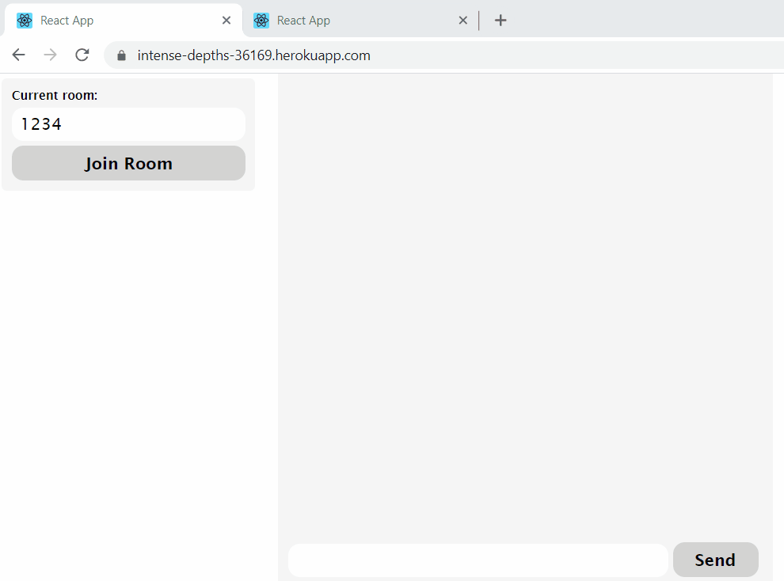

# react-chat-heroku

This basic chat app is built with react + node and uses socket.io. Chats are confined to users within the same room.

Here's a [live version](https://intense-depths-36169.herokuapp.com/) deployed on Heroku. 

## UI

## Contributing
Pull requests are welcome. For major changes, please open an issue first to discuss what you would like to change.

## License
[MIT](https://choosealicense.com/licenses/mit/)
